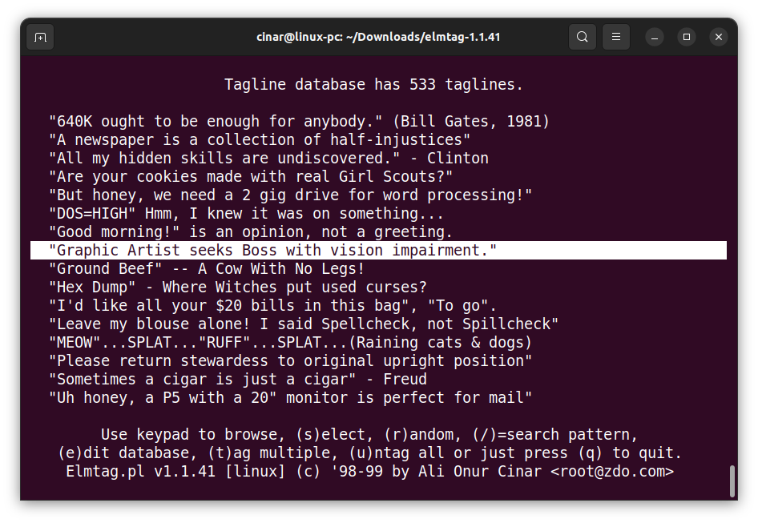

# NAME

elmtag - add taglines to your e-mails

> This is a PERL script that I wrote back in 1999. Although it is available on [CPAN](https://www.cpan.org/authors/id/A/AO/AOCINAR/) and its mirrors, I wanted to have it also here as a backup.



# SYNOPSIS

**elmtag** \[ **-r** \] *(randomly-select-a-tagline)*

# DESCRIPTION

*Elmtag * is an interactive screen-oriented tagline includer for your
e-mails.

# LICENCE

This program is free software; you can redistribute it and/or modify it
under the terms of the GNU General Public License as published by the
Free Software Foundation; either version 2 of the License, or (at your
option) any later version. And also please DO NOT REMOVE my name, and
give me a CREDIT when you use whole or a part of this program in an
other program.

This program is distributed in the hope that it will be useful, but
WITHOUT ANY WARRANTY; without even the implied warranty of
MERCHANTABILITY or FITNESS FOR A PARTICULAR PURPOSE. See the GNU General
Public License for more details.

# INSTALLATION

There is only two step to make Elmtag.pl ready to work.

## Configuring Elmtag.pl

Open *elmtag.pl* with a text editor and update the fallowing file names.

Location of your tagline database

```perl
$tag_file = '/home/cinar/personel/documents/tags';
```

Your prefered editor

```perl
$your_editor = 'vi';
```

Do you prefere an alphabeticaly ordered list?

```perl
$alphabetical = 1; (1=on, 0=off)
```

centeralize taglines when appending to e-mails?

```perl
$centertags = 1; (1=on, 0=off)
```

Elmtag.pl's configuration are done. Now configure your e-mail program by
fallowing these steps:

## If you use ELM

- Start ELM
- Go to Options menu by pressing 'o'
- press 'E' to change your default editor
- write elmtag.pl (include fullpath if necessaire)
- press '>' to save your settings

Try to send an e-mail, if you can see the ELMTAG's menu, it's working\!

## If you use PINE

- Start PINE
- press 'S' for setup
- press 'C' for config
- go to editor= (it's close to the bottom of list)
- write elmtag.pl (include fullpath if necessaire)
- press 'e' to exit
- press 'y' and save the settings.

Try to send an e-mail, if you can see the ELMTAG's menu, it's working\!

# USAGE

When you want to send an e-mail, your mailer will start Elmtag program,
and you will see an Elm similar user interface which shows the taglines
you have in your database.

``` 
The definition of keys are:

 KEY(S)        MISSION                    DESCRIPTION
S,s,ENTER Select a tag line   will select the hightlighted tagline
                              to append it to the end of your e-mail.

R,r       Random tagline      randomly select a tagline for you

T,t       Tag multiple tags   you can tag/untag multiple taglines to
                               append to your e-mail.

U,u       Untag all           untag all taglines you selected

/         Search pattern      search a keywork in tagline database

Q,q       Quit                to quit Elmtag, to do not add a tagline
                               at this time to your e-mail.

```

# WHERE TO DOWNLOAD

**Latest version can be downloaded from:**

- [ftp://hun.ece.drexel.edu/pub/cinar/elmtag](ftp://hun.ece.drexel.edu/pub/cinar/elmtag)
- [ftp://ftp.cpan.org/pub/CPAN/authors/id/A/AO/AOCINAR/elmtag](ftp://ftp.cpan.org/pub/CPAN/authors/id/A/AO/AOCINAR/elmtag)
- [ftp://sunsite.unc.edu/pub/Linux/system/mail/misc/elmtag](ftp://sunsite.unc.edu/pub/Linux/system/mail/misc/elmtag)

# BUG REPORTS TO

Ali Onur Cinar

# COPYRIGHTS

Copyright 1998 by Ali Onur Cinar

